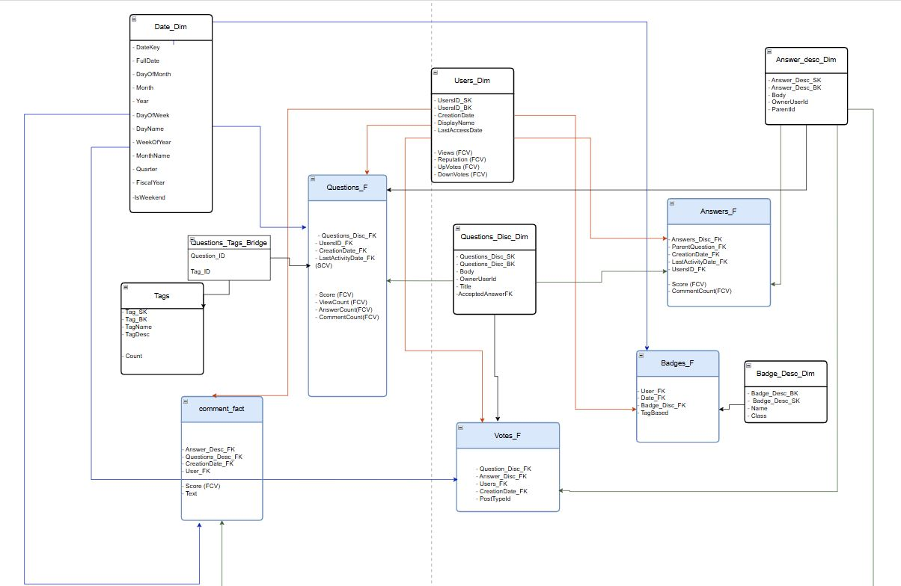
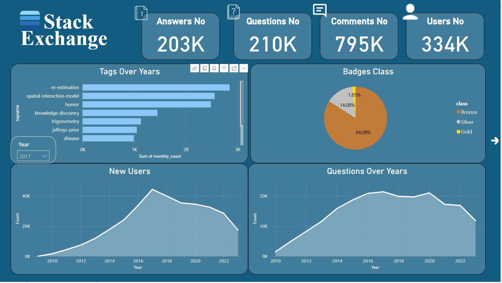
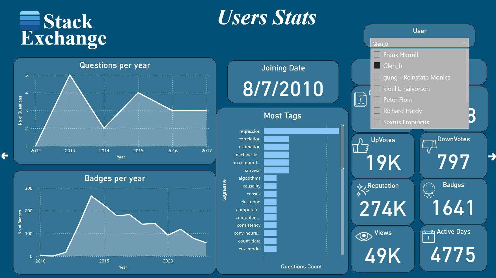
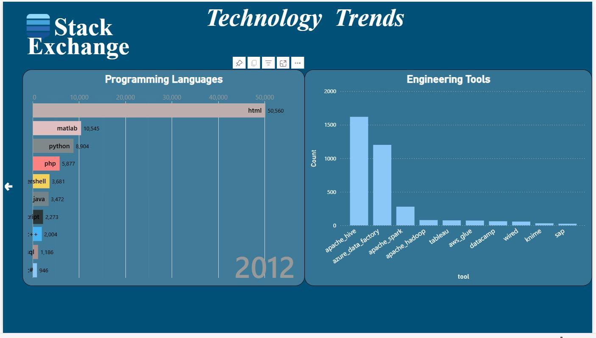

# 📦 Stack Exchange Data Warehouse & Analytics

A modern and scalable data pipeline to ingest, process, and analyze large-scale XML datasets from Stack Exchange, built with distributed tools and best practices in data engineering.

---

## 📊 Overview

This project implements an **end-to-end data lakehouse** following the **Bronze → Silver → Gold → Platinum** medallion architecture and culminates in interactive Power BI dashboards.

---

## 🔁 Data Pipeline Architecture

> **Layers**  
> 🔸 Bronze → raw XML data in HDFS  
> 🔹 Silver → cleansed Parquet via Spark  
> 🏅 Gold → dimensional tables in PostgreSQL  
> 💎 Platinum → domain‑specific data marts  
> 📊 Analysis → Power BI dashboards

---

## 🧪 Exploratory Data Analysis

- Performed EDA on raw XML datasets using **Python**, **Pandas**, and **Seaborn**  
- Identified data quality issues, distributions, and key patterns  
- Generated visualizations to inform schema design

---

## 🏗️ Dimensional Modeling

- Designed **star schemas** for core business processes:   
- Defined primary/foreign keys, hierarchies, and grain  
- Documented mapping from XML elements to warehouse tables

---

## 🚚 ETL (Bronze → Silver → Gold)

1. **Ingestion (Bronze)**  
   - Load raw XML into Hadoop HDFS  
2. **Transformation (Silver)**  
   - Clean & normalize with Apache Spark  
   - Output Parquet files for performance  
3. **Loading (Gold)**  
   - Push dimensions & facts into PostgreSQL  

---

## 🏛️ Data Warehouse (Gold Layer)

- **Fact tables**  
- **Dimension tables** 
- **Indexes & partitions** for query speed  
---

## 💎 Data Marts (Platinum Layer)

- **User Activity Mart**  
- **Tag Trends Mart**  
- **Engagement Mart**  

Each mart is built as a set of SQL views over the warehouse tables, optimized for its domain.

---

## 📊 Dashboard (Analysis Layer)

Explore the full `.pbix` in [`Insights`](Insights).
Power BI publish[Power BI Puplish](https://app.powerbi.com/groups/me/reports/f3e1e1c6-580c-4a27-b699-e31e4db28a55/05a4b39b2712cab9a9f4?experience=power-bi)

---

## ⚙️ Technologies Used

| Purpose              | Tools                        |
|----------------------|------------------------------|
| Ingestion & EDA      | Python, Pandas, Seaborn      |
| Storage              | Hadoop HDFS                  |
| Processing           | Apache Spark                 |
| Data Warehouse       | PostgreSQL                   |
| Data Marts           | SQL Views                    |
| Visualization        | Power BI                     |
| Containerization     | Docker                       |

